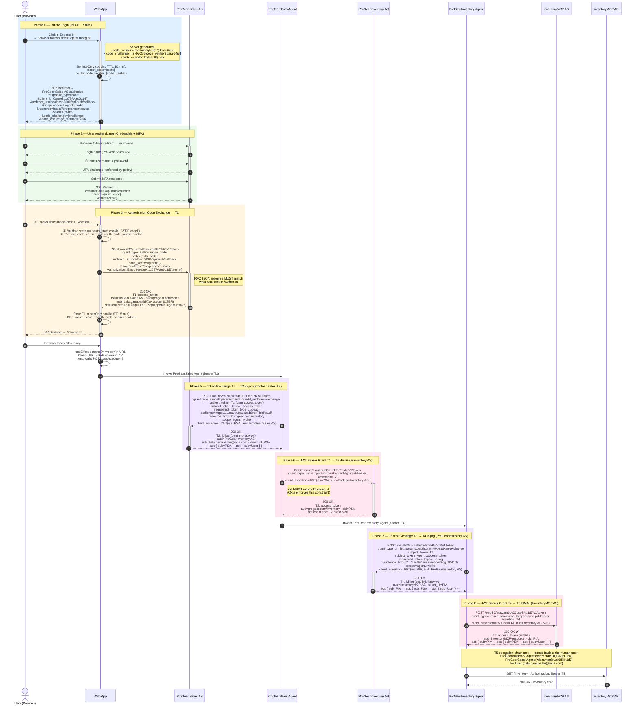

# A2A Identity Chaining — Human Identity (HI) Flow Sequence Diagram

## Use Case — ProGear Sales Rep Checking Live Inventory During a Customer Call

### Scenario

**bala.ganaparthi@okta.com**, a ProGear sales representative, is on a live call with a customer who wants to place a bulk order for outdoor equipment. The customer asks: *"Do you have 200 units of the TR-9 Trail Pack in stock, and can you confirm delivery lead time?"*

Rather than putting the customer on hold to check a static spreadsheet, the sales rep opens the **ProGear Sales Web App** and clicks **▶ Execute HI**. Behind the scenes, the app orchestrates a chain of AI agents that query the live **InventoryMCP Server** in real time — and every hop in that chain carries the sales rep's verified identity.

---

### Why Human Identity (HI) matters here

#### 1. Accountability — every API call traces back to a person
The `act` delegation chain embedded in the final token (T5) records exactly who initiated the request:

```
InventoryMCP API receives T5 with:
  act: {
    sub: "wlpzantdeiOQGRrpF1d7"   ← ProGearInventory Agent acted
      act: {
        sub: "wlpzamsn8ruzX9RiH1d7"  ← ProGearSales Agent acted on behalf of
          act: {
            sub: "bala.ganaparthi@okta.com"  ← human initiated
          }
      }
  }
```

The InventoryMCP Server can answer: **"Which sales rep requested this inventory check, and through which agents?"** — not just "some service account did it."

#### 2. MFA-enforced trust before the chain starts
The ProGear Sales AS requires the sales rep to complete **Multi-Factor Authentication** (Phase 2) before T1 is issued. No T1 = no chain. This means:
- A stolen credential alone cannot trigger the inventory access
- The human identity is cryptographically verified before any agent acts

#### 3. User-scoped authorisation at every hop
Because T1's `sub` is a real user (not a machine), each downstream AS can apply **user-level policies**:
- The ProGearInventory AS can restrict which product categories a given rep can query
- The InventoryMCP Server can enforce per-user rate limits or data visibility rules (e.g., a junior rep sees regional stock only; a senior rep sees global stock)

These policies would be impossible to apply correctly if `sub` were a generic service account.

#### 4. Compliance and audit trails
In regulated industries (retail finance, healthcare procurement, defence), audit logs must show **human intent** behind automated workflows. The HI flow satisfies requirements such as:
- *"Who approved querying this inventory level?"* — answered by T5's `act` chain
- *"Was MFA enforced at the point of access?"* — answered by T1's `auth_time` claim and the AS's MFA policy
- *"Could an automated script have triggered this without a person?"* — No: `authorization_code` + PKCE requires a live browser session

#### 5. NHI is not suitable here
| Requirement | NHI (service account) | HI (user identity) |
|---|---|---|
| Identify which sales rep acted | ❌ Only shows service client ID | ✅ Shows `bala.ganaparthi@okta.com` |
| Enforce per-user product restrictions | ❌ All service accounts share same access | ✅ Policies applied per user |
| Require MFA before chain starts | ❌ Not applicable | ✅ Enforced by ProGear Sales AS |
| Audit trail maps to a human | ❌ Untraceable to a person | ✅ Full delegation chain to user |
| Suitable for automated/scheduled jobs | ✅ Yes | ❌ Requires browser session |

---

### When to use HI vs NHI

| Use HI when… | Use NHI when… |
|---|---|
| A human initiates the workflow (click, form submit, dashboard action) | The workflow runs on a schedule or is triggered by a system event |
| Per-user authorisation policies must be enforced at downstream APIs | All callers share identical access rights |
| Audit logs must identify a named individual | Machine-to-machine background processing |
| Compliance requires MFA-verified human intent | Low-risk internal data pipelines |
| The downstream resource is sensitive (PII, financial, regulated data) | High-volume, latency-sensitive workloads |

---

## Overview

The HI flow differs from the NHI (Service Client) flow only in **how T1 is obtained**:

| | NHI | HI |
|---|---|---|
| T1 grant type | `client_credentials` | `authorization_code` + PKCE |
| T1 subject (`sub`) | Service client ID (`0oazakcme19yZ44th1d7`) | User email (`bala.ganaparthi@okta.com`) |
| T1 `sub_profile` | `service` | `user` (or omitted) |
| T1 `cid` | `0oazakcme19yZ44th1d7` | `0oazektoz797Aaq0L1d7` (web app) |
| MFA | None | Enforced by ProGear Sales AS policy |
| T1→T2 exchange | Org AS | **ProGear Sales AS** |
| T3→T4 exchange | Org AS | **ProGearInventory AS** |

---

## Participants

| Alias | Name | ID |
|---|---|---|
| User | End User (browser) | `bala.ganaparthi@okta.com` / `00uw25t4pqnHgHldK1d7` |
| WebApp | Web App (Next.js — includes `/api/auth/login` + `/api/auth/callback`) | `http://localhost:3000` |
| ProGearAS | ProGear Sales AS | `auszakltaaxuEH0s71d7` |
| PSA | ProGearSales Agent | `wlpzamsn8ruzX9RiH1d7` |
| PIAS | ProGearInventory AS | `auszalb8rzrFTrhPa1d7` |
| PIA | ProGearInventory Agent | `wlpzantdeiOQGRrpF1d7` |
| MCPAS | InventoryMCP AS | `auszam0ov23cgv2Kd1d7` |
| MCP | InventoryMCP API | `progear.com/inventoryMCP-resource` |

---

## Diagram



---

## Token Lineage

```
T1  access_token (user)   ← authorization_code + PKCE  at ProGear Sales AS
                             sub = bala.ganaparthi@okta.com (HUMAN USER)
                             aud = https://progear.com/sales
                             cid = 0oazektoz797Aaq0L1d7 (web app)

T2  id-jag                ← token-exchange(T1)          at ProGear Sales AS
                             aud = ProGearInventory AS
                             act chain: PSA → User

T3  access_token          ← jwt-bearer(T2)               at ProGearInventory AS
                             aud = progear.com/inventory
                             act chain preserved

T4  id-jag                ← token-exchange(T3)           at ProGearInventory AS
                             aud = InventoryMCP AS
                             act chain: PIA → PSA → User

T5  access_token ✅        ← jwt-bearer(T4)               at InventoryMCP AS
                             aud = inventoryMCP-resource
                             act chain: PIA → PSA → User (traces to human)
```

---

## Required Okta Configuration

| # | Where | What |
|---|---|---|
| 1 | ProGear Sales AS (`auszakltaaxuEH0s71d7`) → Access Policies | Add policy rule for HI client `0oazektoz797Aaq0L1d7`: grant=Authorization Code, scope=`openid agent.invoke`, resource=`progear.com/sales` |
| 2 | ProGear Sales AS (`auszakltaaxuEH0s71d7`) → Token Exchange Policies | Allow user tokens as valid `subject_token` for `id-jag` exchange by ProGearSales Agent (`wlpzamsn8ruzX9RiH1d7`) |
| 3 | ProGearInventory AS (`auszalb8rzrFTrhPa1d7`) → Token Exchange Policies | Allow T3 access tokens as valid `subject_token` for `id-jag` exchange by ProGearInventory Agent (`wlpzantdeiOQGRrpF1d7`) |
| 4 | Application `0oazektoz797Aaq0L1d7` → Redirect URIs | Add `http://localhost:3000/api/auth/callback` |

---

## Key Differences vs NHI Flow

| | NHI (Service Client) | HI (User Sign-On) |
|---|---|---|
| Button | ▶ Execute NHI | ▶ Execute HI |
| T1 mechanism | `client_credentials` (no browser redirect) | `authorization_code` + PKCE (browser redirect to Okta) |
| T1 `sub` | Service client app ID | Human user email |
| PKCE | Not used | Required (S256) |
| MFA | Not applicable | Enforced by ProGear Sales AS |
| httpOnly cookies | Not used | `oauth_state`, `oauth_code_verifier`, `hi_access_token` |
| Callback endpoint | Not used | `/api/auth/callback` |
| T1 → T2 exchange AS | Okta Org AS | **ProGear Sales AS** |
| T3 → T4 exchange AS | Okta Org AS | **ProGearInventory AS** |
| T5 act chain root | Service client | Human user (`bala.ganaparthi@okta.com`) |
