# Step By Step Curl Commands to exchange A2A tokens

## 1. Get ProGear Service Client Tokens using OAuth client credentials grant flow for ProGearSales Agent

```bash
curl --location 'https://ok-secures-ai.oktapreview.com/oauth2/proj/v1/token' \
--header 'Content-Type: application/x-www-form-urlencoded' \
--header 'Authorization: Basic <B64{ClientID:ClientSecret}>' \
--data-urlencode 'grant_type=client_credentials' \
--data-urlencode 'scope=agent.invoke' \
--data-urlencode 'resource=https://progear.com/sales'
```

Store the access token from the response for use in the next step.
(response will contain an `access_token` field, which is the ProGear Service Client Token)

## 2. This call will be made at ProGearSales Agent : Token Exchange using the ProGear Service Access Token to get a IDJAG for ProGearInventory Agent

```bash
curl --location 'https://ok-secures-ai.oktapreview.com/oauth2/v1/token' \
--header 'Content-Type: application/x-www-form-urlencoded' \
--data-urlencode 'grant_type=urn:ietf:params:oauth:grant-type:token-exchange' \
--data-urlencode 'subject_token={AccessTokenFromStep1}' \
--data-urlencode 'subject_token_type=urn:ietf:params:oauth:token-type:access_token' \
--data-urlencode 'requested_token_type=urn:ietf:params:oauth:token-type:id-jag' \
--data-urlencode 'audience=https://ok-secures-ai.oktapreview.com/oauth2/hen ' \
--data-urlencode 'resource=https://progear.com/inventory' \
--data-urlencode 'client_assertion_type=urn:ietf:params:oauth:client-assertion-type:jwt-bearer' \
--data-urlencode 'client_assertion={JWTBearerToken}' \
--data-urlencode 'scope=agent.invoke'
```

{AccessTokenFromStep1} - This is the ProGear Service Client Token obtained from Step 1.
{JWTBearerToken} - This is a JWT token signed by the ProGearSales Agent, which contains the necessary claims to authenticate the ProgearSales agent. The JWT should include claims such as `sub`, `aud`, `iss`, and any other claims required by the authorization server for client authentication.

Claims in {JWTBearerToken}:

```json
{
  "iss": "wlpzamsn8ruzX9RiH1d7",
  "sub": "wlpzamsn8ruzX9RiH1d7",
  "aud": "https://ok-secures-ai.oktapreview.com/oauth2/v1/token",
  "exp": 1780042293,
  "iat": 1780042233,
  "jti": "c0dce9dd-9987-4430-bd61-00f2f831ab45"
}
```

PrivateKeyJWK used to sign the JWT Bearer Token -

```json
{
  "alg": "RS256",
  "d": "BTwqw0cTm753D84bXnnOkUi5wrui7zfoFa7V-OHH4BBgOdw37sy6OzsnI3DZInP_BZR-iY7wmJHr5QtLkEmOGwwyATHiu0bpp4P7fFu5d0bqJs4AVQ5ODOVbLFnMlquvVbQ3v62PLYH3k3o1fRIJLrOW17vinRuSSkVJdDJUGBOOqYwTd2pkL4JXv_i-qHHmMb0BeyK7IO4wqqMICIW44UPn1-03y1Eh4Xn8iSHwW74IuvOM2OdibuvQh4OVFhqkIzFrUogaTOprYE6QWzQfbWhO06W9w31QgawUnck8weUdC2rrtfwhgc5UaoWrnKSRsKTALCUWGSMuVEpEJhBVAQ",
  "dp": "Ix1nGJs3Au5aeF6W27lo2ryt53pmRhrXvO03lQAhcCSzC-l8LSJb1BAl1mnj7nO9DSN0bxBoLurq6BcrfbeUfDVdmLDrf6bnXqigVLkhR26M365juhdSW1aLZtdY3vqYeaoZOdVlGM5WU-65dWrefCA1ENXpNGE980ZwfonwYgE",
  "dq": "ZyiL-pvO1U-M4PXbyc4db6Y-nC8JqXZPZUnFfdlwwijX_rBUdJsq0y6RhcIMAzxo6ab3DeR3XMe1LHVTmqFEzBrHhPL5G5rDBTyjesL28YfFNpYLX909m9fnd_rfp9jKzkkVSLGKY9vd53ybgXJZ6sHrKXTsVmoWK7H4d292omE",
  "e": "AQAB",
  "kty": "RSA",
  "n": "yk6vSZ9o3hCwWw0QougPtoeGs6h4veB1YXKxNzseYAHa8EYC--33M10Zsf4C4DmV2k0xduRhN1ipXaOrelkCX8nQsmlklEJViursVT7daatEGEBTydP5nV_1_iWKcIpGcPWr3WcGB4gnnf-BFuRlBj-\_Sg8I4umf2xpunAQx850gpT2OmOrPCDKvq5T2Y-19vZnWYpr5cYsU13eWIokb4s3G6jWts7InTj_MkgMBwpiuLFIL9hRJu4f3SVntQ4i5uarj9kCwcoFDTMRGRGLV0BSesuSvIWke6wTv0hCeGb5uiPkZF2X0dhkGmV1fjX-VRZnfZ3iRoKqFVuPhoInYWQ",
  "p": "5zIazHfwuiH79IFlB5FtGc8m1rRHaDAW1PjdB1kZd9nQLf98521T2j6y3Anvpuc_CEtX-E5eupbBlPZe3zYDfgQO-DHl_N9qXBJJEx7crXCaQ6vv9tHfdSTzVK8VM0TBt4pjKwRYOA0lPz4eqO0eyOC0rBSgioe_7Fx6IrsZQQE",
  "q": "4AMl7SIclA5E4blUpuH3Oicj4mSva8tqiTjJvjwt-K9MpLKiBcPNxRwZjUekBv48pmP2inaYWuyByGBcbJ3WG8A-KDGoHCBs2L2Jpd6PSiAnnbL-\_5Bq407qLqOsjk4g-M5SvF43FHHiGjcPN8vYNbWbu3ZuGK\_\_pFKwLNrDP1k",
  "qi": "zF_c-XmKCOQjW5PfyV1uWdhCOpDfPjiGQCV_mriNXO5mHYTzM0klr9jTa5Kd2zbK0iQMMegWMKP0f43vkVsp0jUQ_rmZ_Eu88c_bjNTsBtIcfpBX25p27x3XLepfGzwp2pVqQ_6wvqSGZkb651uX3lwU7B4A7paK5AftBvQxVsk",
  "kid": "a7531e69eadb5b5ab26488c49aa183e7",
  "use": "sig"
}
```

Script used to generate JWT Bearer Token at Postman pre-request:

```postman-javascript
const b64url = s => Buffer.from(typeof s === 'string' ? s : JSON.stringify(s)).toString('base64').replace(/=/g,'').replace(/\+/g,'-').replace(/\//g,'_');
const b64urlBytes = b => Buffer.from(b).toString('base64').replace(/=/g,'').replace(/\+/g,'-').replace(/\//g,'_');

  const jwk = JSON.parse(pm.collectionVariables.get('PrivateKeyJWK'));
  const iss = pm.collectionVariables.get('a2aAgentProGearSalesId');
  const aud = pm.collectionVariables.get('a2aOrgUrl') + '/oauth2/v1/token';
  const hdr = { alg: 'RS256', kid: jwk.kid, typ: 'JWT' };
  const now = Math.floor(Date.now()/1000);
  const pl = { iss, sub: iss, aud, exp: now+60, iat: now, jti: pm.variables.replaceIn('{{$guid}}') };
  const input = b64url(hdr) + '.' + b64url(pl);
  const key = await crypto.subtle.importKey('jwk', jwk, { name: 'RSASSA-PKCS1-v1_5', hash: 'SHA-256' }, false, ['sign']);
  const sig = await crypto.subtle.sign('RSASSA-PKCS1-v1_5', key, new TextEncoder().encode(input));
  pm.collectionVariables.set('a2aClientAssertion', input + '.' + b64urlBytes(sig));
```

Variables used in the script:

- `PrivateKeyJWK`: The RSA private key in JWK format used to sign the JWT.
- `a2aAgentProGearSalesId`: The client ID of the ProGearSales Agent, which will be used as the `iss` and `sub` claims in the JWT.
- `a2aOrgUrl`: The base URL of the Okta organization, used to construct the `aud` claim in the JWT.
- `a2aClientAssertion`: The generated JWT Bearer Token that will be used as the `client_assertion` in the token exchange request.

The response from this request will contain an `access_token` field, which is the IDJAG that can be used to authenticate requests from ProGearSales Agent to ProGearInventory Agent in next step

## 3. Use the obtained IDJAG from Step 2 to exchange for an A2A access token that can be used to call ProGearInventory Agent API

Agent ProGearSales will call the token endpoint with the ProGearInventory Agent's audience, and include the obtained IDJAG in the `assertion` parameter, along with a JWT client assertion for authentication.

Below is the curl command used to exchange the IDJAG for an ProGearInventory A2A access token:

```bash
curl --location 'https://ok-secures-ai.oktapreview.com/oauth2/auszalb8rzrRVrhPa1d7/v1/token' \
--header 'Content-Type: application/x-www-form-urlencoded' \
--data-urlencode 'grant_type=urn:ietf:params:oauth:grant-type:jwt-bearer' \
--data-urlencode 'assertion={ID-JAG-FOR-PROGEARINVENTORY}' \
--data-urlencode 'client_assertion_type=urn:ietf:params:oauth:client-assertion-type:jwt-bearer' \
--data-urlencode 'client_assertion={JWTBearerToken}'
```

{ID-JAG-FOR-PROGEARINVENTORY} - This is the IDJAG obtained from Step 2.
{JWTBearerToken} - This is a JWT token signed by the ProGearSales Agent, which contains the necessary claims to authenticate the ProGearSales Agent when calling the ProGearInventory Agent. The `iss` and `sub` must match the `client_id` embedded in the IDJAG (T2). The JWT should include claims such as `sub`, `aud`, `iss`, and any other claims required by the authorization server for client authentication.

Claims in {JWTBearerToken}:

```json
{
  "iss": "wlpzamsn8ruzX9RiH1d7",
  "sub": "wlpzamsn8ruzX9RiH1d7",
  "aud": "https://ok-secures-ai.oktapreview.com/oauth2/auszalb8rzrRVrhPa1d7/v1/token",
  "exp": 1780040007,
  "iat": 1780039947,
  "jti": "85a7589b-2bb6-4589-a70b-5d63d2a10ccd"
}
```

> **Note:** The `iss`/`sub` must be `wlpzamsn8ruzX9RiH1d7` (ProGearSales Agent), not the ProGearInventory Agent ID. Okta enforces that the `client_id` in the JWT bearer grant assertion (T2) matches the `client_id` used to authenticate the client. The `aud` must be the ProGearInventory AS token endpoint (`auszalb8rzrRVrhPa1d7`), not the InventoryMCP AS.

The PrivateKeyJWK is the same as used in Step 2 (kid: `a7531e69eadb5b5ab26488c49aa183e7`) — ProGearSales Agent's private key.

The response from this request will contain an `access_token` field {PROGEARINVENTORY-A2A-ACCESS-TOKEN}, which is the A2A access token that can be used to authenticate API calls from ProGearSales Agent to ProGearInventory Agent.

## 4. Use the obtained A2A access token from Step 3 to exchange for ProGearInventory Agent IDJAG that can be used for token exchange to call InventoryMCP API

```bash
curl --location 'https://ok-secures-ai.oktapreview.com/oauth2/v1/token' \
--header 'Content-Type: application/x-www-form-urlencoded' \
--data-urlencode 'grant_type=urn:ietf:params:oauth:grant-type:token-exchange' \
--data-urlencode 'subject_token={PROGEARINVENTORY-A2A-ACCESS-TOKEN}' \
--data-urlencode 'subject_token_type=urn:ietf:params:oauth:token-type:access_token' \
--data-urlencode 'requested_token_type=urn:ietf:params:oauth:token-type:id-jag' \
--data-urlencode 'audience=https://ok-secures-ai.oktapreview.com/oauth2/auszam0ov23cgv2Kd1d7' \
--data-urlencode 'client_assertion_type=urn:ietf:params:oauth:client-assertion-type:jwt-bearer' \
--data-urlencode 'client_assertion={JWTBearerToken}' \
--data-urlencode 'scope=agent.invoke'
```

{PROGEARINVENTORY-A2A-ACCESS-TOKEN} - This is the A2A access token obtained from Step 3.
{JWTBearerToken} - This is a JWT token signed by the ProGearInventory Agent, which contains the necessary claims to authenticate the ProGearInventory Agent when calling the Org AS. The JWT should include claims such as `sub`, `aud`, `iss`, and any other claims required by the authorization server for client authentication.

Claims in {JWTBearerToken}:

```json
{
  "iss": "wlpzantdeiOQGRrpF1d7",
  "sub": "wlpzantdeiOQGRrpF1d7",
  "aud": "https://ok-secures-ai.oktapreview.com/oauth2/v1/token",
  "exp": 1780042841,
  "iat": 1780042781,
  "jti": "e101ad08-74a2-4a3d-b7e4-c8885d851866"
}
```

PrivateKeyJWK used to sign the JWT Bearer Token -

```json
{
  "alg": "RS256",
  "d": "DOPxEEyQoRmCVQvtmnT1LfOUkdK1BWXD7YrwonbnbgciqGXDmpSa-tyfkC6OPV_x_JDtK47YAfC60VcIi3_2c7rVGE6_FZPUKx5VZR5bZzDFvwSs0UqRn1x4_uA-_Ffb6eNjrIrCKPdSmfhx8GBZFBU0dByzdbRlI4OMRXYld30URKhQr_-OHPL_v7KlG8Z9jfniQhSDGTqVhQToimIJtb5cg95MhdvnT4sMXItH3GIErshc4tEjmD3cf9Lp986yIEWDMaThw5gCHp4UEumwgsfnKp-URCVhAWTf1mMpmgawxMyALIjUVSYX3d2HlsZZRCYb4Kr0cIQ5xU84rujlYQ",
  "dp": "HqD6y8mMDO2Ztq6-eRLImEKBY9g8C337P08klUzUbWorMLVDXtQgJRPqeRGQ-7Crv2lTj2k1jCFU8d8drVUy7_Q1-8OQdu08Wp2JxLUnjWZjmgHMW_NslvqZfewJVdZ4gmvpLkBuWvPT9nNF5wl6nOM-6X0YJHQaUV_-1r7cLTk",
  "dq": "xd6l-YMerZJFjdK5FxUOVQY3OLshOQmwfPMgQLVvD6U6PGwlI4ZzYElceP6PyIBJzril5Ov_fmrcSBle7G1ISzkOqFDZJ5s-ywi65BIQo_NoEiZ9vbXjI2QaYYYJvl_C8VrGy2YwFnGBMctUWnihalxN5S8PyCY8wLT216zJvK8",
  "e": "AQAB",
  "kty": "RSA",
  "n": "ulM5Cl47RDbZaUKphYIudp0bhRjkHRDmjYsiEdDnjEjDG3bo3rL162ziHtXKPnUt_Tp646gewn9r9bcoOzN9qu1p_NRDjBP5KkMbLxNW7SbJOEKdwPQU4xjAKSy114H9nUO64uPO-aWizB0hIh6SX-OSw2y44WOlp7tUaWHYV8emQzKsmfH2YU_Sw70UY9LwqYt5cBEScp7cJ1Cy_KL7fI764D_jNbzrC4UkHhvNJdwXdyT04p3Rds1T08rLeQjByfL3bz_t0rE7IYyub7J1Cy-d3AtgSe0KMUpUnIwuVdGjshupdB3pO4Sa-4KocE9a80vWL2zeFm-Vthj4CKiOhw",
  "p": "3W-7OlOH4N5_JYtmQO6fazQmeTKTWePksxy3sEntB4Ak6CZL20XsNYuxaALE3yWEBs7cWmQq9p7pTOaK5j29x8cCSWmY_hlz3dNyhaj4XMvssdd0_kVuLXG82936PEJ855V3NSp2bFXu81rcDwGoA1QQ9wxGMW2CmPWV1jIRdHk",
  "q": "12h-fBTwkia4BQk6NeeA6ZiooSjlNMoHz2bVOWTCmGqf7G6WKykLQDOyFrIASy7gMSJosVncE8rSe16os4EK877634fZj19AbfuLC3kMVhpstP5yiRrf6ZP4dGHNdR0jkVehWbEmQNJ57lIW4I66T7BuBmQmDBxo9ldvtaYrWv8",
  "qi": "bqgK4T7GfURR1uhAxAkRP9v92uNSEPEF_XA0p4BrKHajO-j9uEgACUdD0d7bK-jPUbNofBtcL4b9FkMwlgSWiS3lOPWKRQAlLHSGsqaBpUHA0PIsllmmPxu8jFnCh9aHE2yH4_ZC_XMPfhu77qDRf9teK8hOIPKpde41an2Oqxg",
  "kid": "3804ec3c470466c9f49f34f5c448418d",
  "use": "sig"
}
```

The response from this request will contain an `access_token` {IDJAG-FOR-INVENTORYMCP} field, which is the IDJAG that can be used to authenticate requests from ProGearInventory Agent to InventoryMCP API.

## 5. Use the obtained IDJAG from Step 4 to exchange for an access token that can be used to call InventoryMCP API

```bash
curl --location 'https://ok-secures-ai.oktapreview.com/oauth2/auszam0ov23cgv2Kd1d7/v1/token' \
--header 'Content-Type: application/x-www-form-urlencoded' \
--data-urlencode 'grant_type=urn:ietf:params:oauth:grant-type:jwt-bearer' \
--data-urlencode 'assertion={IDJAG-FOR-INVENTORYMCP}' \
--data-urlencode 'client_assertion_type=urn:ietf:params:oauth:client-assertion-type:jwt-bearer' \
--data-urlencode 'client_assertion={JWTBearerToken}'
```

{IDJAG-FOR-INVENTORYMCP} - This is the IDJAG obtained from Step 4.
{JWTBearerToken} - This is a JWT token signed by the ProGearInventory Agent, which contains the necessary claims to authenticate the ProgearInventory agent when calling InventoryMCP API. The JWT should include claims such as `sub`, `aud`, `iss`, and any other claims required by the authorization server for client authentication.

Claims in {JWTBearerToken}:

```json
{
  "iss": "wlpzantdeiOQGRrpF1d7",
  "sub": "wlpzantdeiOQGRrpF1d7",
  "aud": "https://ok-secures-ai.oktapreview.com/oauth2/auszam0ov23cgv2Kd1d7/v1/token",
  "exp": 1780043158,
  "iat": 1780043098,
  "jti": "df5f0702-3943-4b34-b9fe-5450eaca18fa"
}
```

The PrivateKeyJWK is the same as used in Step 4 to generate the JWT Bearer Token for client authentication.

The response from this request will contain an `access_token` field, which is the access token that can be used to authenticate API calls from ProGearInventory Agent to InventoryMCP API.

## T5 — Final Token Delegation Chain

The final access token (T5) issued by InventoryMCP AS carries a nested `act` claim that encodes the full A2A delegation chain. This allows InventoryMCP to verify every hop in the chain of trust:

```json
{
  "iss": "https://ok-secures-ai.oktapreview.com/oauth2/auszam0ov23cgv2Kd1d7",
  "aud": "https://progear.com/inventoryMCP-resource",
  "sub": "0oazakcme19yZ44th1d7",
  "sub_profile": "service",
  "cid": "wlpzantdeiOQGRrpF1d7",
  "scp": ["agent.invoke"],
  "act": {
    "sub": "wlpzantdeiOQGRrpF1d7",
    "sub_profile": "ai_agent",
    "act": {
      "sub": "wlpzamsn8ruzX9RiH1d7",
      "sub_profile": "ai_agent",
      "act": {
        "sub": "0oazakcme19yZ44th1d7",
        "sub_profile": "service"
      }
    }
  }
}
```

Reading the `act` chain from innermost to outermost:

| Principal              | ID                     | Role                                  |
| ---------------------- | ---------------------- | ------------------------------------- |
| Service Client         | `0oazakcme19yZ44th1d7` | Origin — initiated the request        |
| ProGearSales Agent     | `wlpzamsn8ruzX9RiH1d7` | Acted on behalf of the service client |
| ProGearInventory Agent | `wlpzantdeiOQGRrpF1d7` | Acted on behalf of ProGearSales       |
| InventoryMCP API       | —                      | Final recipient (`aud`)               |

## Sequence Diagram

Full diagram with all grant types, token shapes, and IDs: see **[SEQUENCE_DIAGRAM.md](./SEQUENCE_DIAGRAM.md)**

```mermaid
sequenceDiagram
    autonumber

    actor       SC      as Service Client
    participant ProGearAS as ProGear Custom AS
    participant PSA     as ProGearSales Agent
    participant OrgAS   as Okta Org AS
    participant PIAS    as ProGearInventory AS
    participant PIA     as ProGearInventory Agent
    participant MCPAS   as InventoryMCP AS
    participant MCP     as InventoryMCP API

    rect rgb(0, 60, 35)
        Note over SC,ProGearAS: Step 1 — Client Credentials Grant
        SC->>+ProGearAS: POST /oauth2/auszakltaaxuEV0s71d7/v1/token<br/>grant_type=client_credentials · scope=agent.invoke<br/>resource=https://progear.com/sales
        ProGearAS-->>-SC: T1: access_token<br/>aud=progear.com/sales · sub=ServiceClient
    end

    SC->>PSA: Invoke ProGearSales Agent (bearer T1)

    rect rgb(0, 35, 80)
        Note over PSA,OrgAS: Step 2 — Token Exchange → id-jag (Org AS)
        PSA->>+OrgAS: POST /oauth2/v1/token<br/>grant_type=token-exchange · subject_token=T1<br/>requested_token_type=id-jag<br/>audience=ProGearInventory AS · resource=progear.com/inventory<br/>client_assertion=JWT(iss=PSA, aud=OrgAS)
        OrgAS-->>-PSA: T2: id-jag<br/>aud=ProGearInventory AS · client_id=PSA<br/>act: { PSA → ServiceClient }
    end

    rect rgb(40, 0, 80)
        Note over PSA,PIAS: Step 3 — JWT Bearer Grant (ProGearInventory AS)
        PSA->>+PIAS: POST /oauth2/auszalb8rzrRVrhPa1d7/v1/token<br/>grant_type=jwt-bearer · assertion=T2<br/>client_assertion=JWT(iss=PSA, aud=ProGearInventory AS)
        PIAS-->>-PSA: T3: access_token<br/>aud=progear.com/inventory · cid=PSA
    end

    PSA->>PIA: Invoke ProGearInventory Agent (bearer T3)

    rect rgb(0, 35, 80)
        Note over PIA,OrgAS: Step 4 — Token Exchange → id-jag (Org AS)
        PIA->>+OrgAS: POST /oauth2/v1/token<br/>grant_type=token-exchange · subject_token=T3<br/>requested_token_type=id-jag<br/>audience=InventoryMCP AS<br/>client_assertion=JWT(iss=PIA, aud=OrgAS)
        OrgAS-->>-PIA: T4: id-jag<br/>aud=InventoryMCP AS · client_id=PIA<br/>act: { PIA → PSA → ServiceClient }
    end

    rect rgb(80, 35, 0)
        Note over PIA,MCPAS: Step 5 — JWT Bearer Grant (InventoryMCP AS)
        PIA->>+MCPAS: POST /oauth2/auszam0ov23cgv2Kd1d7/v1/token<br/>grant_type=jwt-bearer · assertion=T4<br/>client_assertion=JWT(iss=PIA, aud=InventoryMCP AS)
        MCPAS-->>-PIA: T5: access_token ✅ FINAL<br/>aud=inventoryMCP-resource · cid=PIA<br/>act: { PIA → PSA → ServiceClient }
    end

    Note over PIA,MCP: T5 carries the full delegation chain (act)
    PIA->>+MCP: GET /inventory · Authorization: Bearer T5
    MCP-->>-PIA: 200 OK
```


