# A2A Identity Chaining — Sequence Diagram

## Participants

| Alias | Name | ID |
|---|---|---|
| SC | Service Client | `0oazakcme19yZ44th1d7` |
| ProGearAS | ProGear Custom AS | `auszakltaaxuEH0s71d7` |
| PSA | ProGearSales Agent | `wlpzamsn8ruzX9RiH1d7` |
| OrgAS | Okta Org AS | `/oauth2/v1/token` |
| PIAS | ProGearInventory AS | `auszalb8rzrFTrhPa1d7` |
| PIA | ProGearInventory Agent | `wlpzantdeiOQGRrpF1d7` |
| MCPAS | InventoryMCP AS | `auszam0ov23cgv2Kd1d7` |
| MCP | InventoryMCP API | `progear.com/inventoryMCP-resource` |

## Diagram

```mermaid
sequenceDiagram
    autonumber

    actor       SC      as Service Client
    participant ProGearAS as ProGear Custom AS
    participant PSA     as ProGearSales Agent
    participant OrgAS   as Okta Org AS
    participant PIAS    as ProGearInventory AS
    participant PIA     as ProGearInventory Agent
    participant MCPAS   as InventoryMCP AS
    participant MCP     as InventoryMCP API

    %% ─────────────────────────────────────────────
    %% STEP 1 — Client Credentials Grant
    %% ─────────────────────────────────────────────
    rect rgb(0, 60, 35)
        Note over SC,ProGearAS: Step 1 — Client Credentials Grant

        SC->>+ProGearAS: POST /oauth2/auszakltaaxuEH0s71d7/v1/token<br/>grant_type=client_credentials<br/>scope=agent.invoke<br/>resource=https://progear.com/sales<br/>Authorization: Basic {0oazakcme19yZ44th1d7:secret}

        ProGearAS-->>-SC: 200 OK<br/>T1: access_token<br/>iss=ProGearAS · aud=progear.com/sales<br/>sub=0oazakcme19yZ44th1d7 · scp=agent.invoke
    end

    SC->>PSA: Invoke ProGearSales Agent (bearer T1)

    %% ─────────────────────────────────────────────
    %% STEP 2 — Token Exchange: T1 → T2 id-jag
    %% ─────────────────────────────────────────────
    rect rgb(0, 35, 80)
        Note over PSA,OrgAS: Step 2 — Token Exchange → id-jag (Org AS)

        PSA->>+OrgAS: POST /oauth2/v1/token<br/>grant_type=urn:ietf:params:oauth:grant-type:token-exchange<br/>subject_token=T1<br/>subject_token_type=...access_token<br/>requested_token_type=...id-jag<br/>audience=https://…/oauth2/auszalb8rzrFTrhPa1d7<br/>resource=https://progear.com/inventory<br/>scope=agent.invoke<br/>client_assertion=JWT(iss=wlpzamsn8ruzX9RiH1d7, aud=OrgAS)

        OrgAS-->>-PSA: 200 OK<br/>T2: id-jag (oauth-id-jag+jwt)<br/>iss=OrgAS · aud=ProGearInventory AS<br/>sub=0oazakcme19yZ44th1d7 · client_id=wlpzamsn8ruzX9RiH1d7<br/>act: { sub=PSA → act: { sub=ServiceClient } }
    end

    %% ─────────────────────────────────────────────
    %% STEP 3 — JWT Bearer Grant: T2 → T3
    %% ─────────────────────────────────────────────
    rect rgb(40, 0, 80)
        Note over PSA,PIAS: Step 3 — JWT Bearer Grant (ProGearInventory AS)
        Note right of PSA: ⚠ client_assertion.iss MUST equal T2.client_id<br/>(Okta enforces this constraint)

        PSA->>+PIAS: POST /oauth2/auszalb8rzrFTrhPa1d7/v1/token<br/>grant_type=urn:ietf:params:oauth:grant-type:jwt-bearer<br/>assertion=T2<br/>client_assertion=JWT(iss=wlpzamsn8ruzX9RiH1d7, aud=ProGearInventory AS)

        PIAS-->>-PSA: 200 OK<br/>T3: access_token<br/>iss=ProGearInventory AS · aud=progear.com/inventory<br/>cid=wlpzamsn8ruzX9RiH1d7<br/>act chain from T2 preserved
    end

    PSA->>PIA: Invoke ProGearInventory Agent (bearer T3)

    %% ─────────────────────────────────────────────
    %% STEP 4 — Token Exchange: T3 → T4 id-jag
    %% ─────────────────────────────────────────────
    rect rgb(0, 35, 80)
        Note over PIA,OrgAS: Step 4 — Token Exchange → id-jag (Org AS)

        PIA->>+OrgAS: POST /oauth2/v1/token<br/>grant_type=urn:ietf:params:oauth:grant-type:token-exchange<br/>subject_token=T3<br/>subject_token_type=...access_token<br/>requested_token_type=...id-jag<br/>audience=https://…/oauth2/auszam0ov23cgv2Kd1d7<br/>scope=agent.invoke<br/>client_assertion=JWT(iss=wlpzantdeiOQGRrpF1d7, aud=OrgAS)

        OrgAS-->>-PIA: 200 OK<br/>T4: id-jag (oauth-id-jag+jwt)<br/>iss=OrgAS · aud=InventoryMCP AS<br/>sub=0oazakcme19yZ44th1d7 · client_id=wlpzantdeiOQGRrpF1d7<br/>act: { sub=PIA → act: { sub=PSA → act: { sub=ServiceClient } } }
    end

    %% ─────────────────────────────────────────────
    %% STEP 5 — JWT Bearer Grant: T4 → T5 (FINAL)
    %% ─────────────────────────────────────────────
    rect rgb(80, 35, 0)
        Note over PIA,MCPAS: Step 5 — JWT Bearer Grant (InventoryMCP AS) — FINAL TOKEN

        PIA->>+MCPAS: POST /oauth2/auszam0ov23cgv2Kd1d7/v1/token<br/>grant_type=urn:ietf:params:oauth:grant-type:jwt-bearer<br/>assertion=T4<br/>client_assertion=JWT(iss=wlpzantdeiOQGRrpF1d7, aud=InventoryMCP AS)

        MCPAS-->>-PIA: 200 OK ✅<br/>T5: access_token (FINAL)<br/>iss=InventoryMCP AS · aud=progear.com/inventoryMCP-resource<br/>cid=wlpzantdeiOQGRrpF1d7 · scp=agent.invoke<br/>act: { sub=PIA → act: { sub=PSA → act: { sub=ServiceClient } } }
    end

    Note over PIA,MCP: T5 carries the full A2A delegation chain (act):<br/>ProGearInventory (wlpzantdeiOQGRrpF1d7)<br/>  └─ ProGearSales (wlpzamsn8ruzX9RiH1d7)<br/>       └─ ServiceClient (0oazakcme19yZ44th1d7)

    PIA->>+MCP: GET /inventory · Authorization: Bearer T5
    MCP-->>-PIA: 200 OK · inventory data
```



## Grant Type Reference

| Step | Grant Type URN | Description |
|---|---|---|
| 1 | `client_credentials` | Service client authenticates with its own credentials |
| 2 | `urn:ietf:params:oauth:grant-type:token-exchange` | Exchanges an access token for an id-jag at the Org AS |
| 3 | `urn:ietf:params:oauth:grant-type:jwt-bearer` | Presents an id-jag to obtain an A2A access token |
| 4 | `urn:ietf:params:oauth:grant-type:token-exchange` | Exchanges an access token for an id-jag at the Org AS |
| 5 | `urn:ietf:params:oauth:grant-type:jwt-bearer` | Presents an id-jag to obtain the final access token |

## Token Lineage

```
T1  access_token       ← client_credentials at ProGear Custom AS
T2  id-jag             ← token-exchange(T1) at Org AS  →  targets ProGearInventory AS
T3  access_token       ← jwt-bearer(T2)     at ProGearInventory AS
T4  id-jag             ← token-exchange(T3) at Org AS  →  targets InventoryMCP AS
T5  access_token ✅    ← jwt-bearer(T4)     at InventoryMCP AS
```

## Key Okta Constraint

When using the `jwt-bearer` grant type, **the `iss` claim of the `client_assertion` JWT must exactly match the `client_id` embedded in the `assertion` (id-jag)**. Okta enforces this to ensure the same agent that received the id-jag is the one presenting it.

This affected Step 3: `client_assertion.iss` must be `wlpzamsn8ruzX9RiH1d7` (matching T2's `client_id`), not the ProGearInventory Agent ID.
